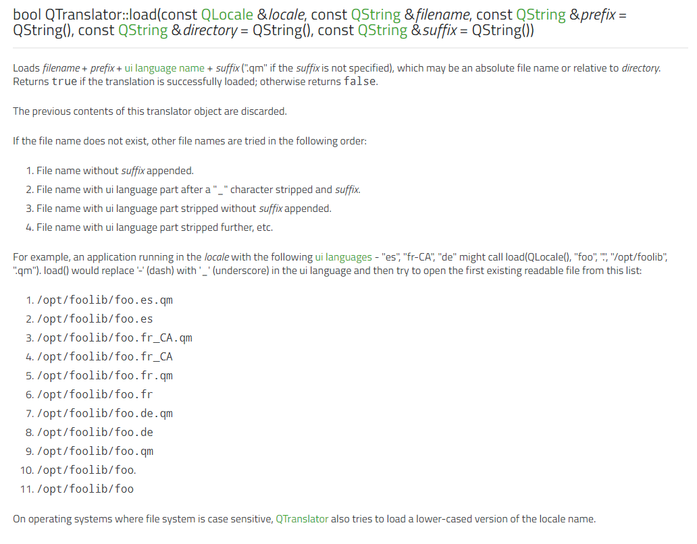
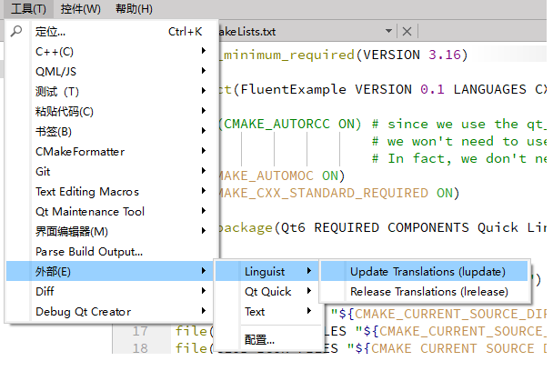
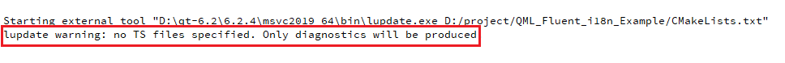
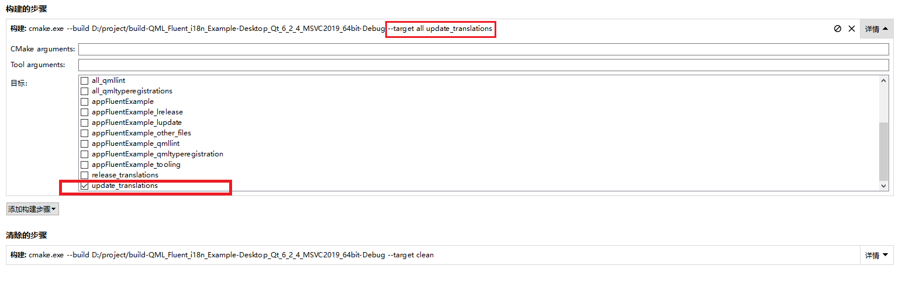
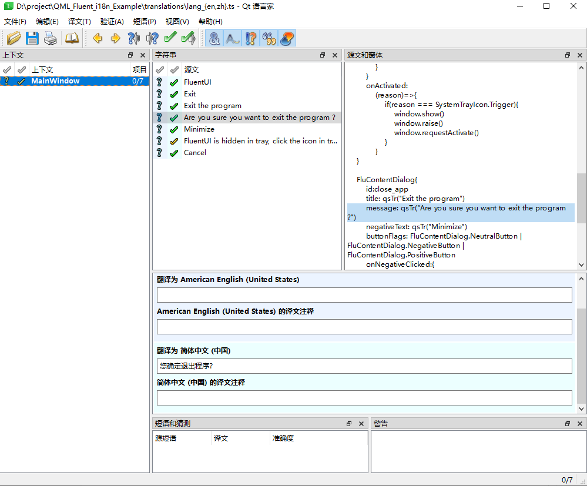

# Qt 6 中加载翻译文件


根据qt官方文档：

+ 在`CMakeLists.txt`中：可以使用

```CMake
qt_add_translations(target TS_FILES file1.ts [file2.ts ...]
                    [RESOURCE_PREFIX [OUTPUT_TARGETS variable-name]]
                    [QM_FILES_OUTPUT_VARIABLE variable-name]
                    [SOURCES]
                    [INCLUDE_DIRECTORIES]
                    [LUPDATE_OPTIONS]
                    [LRELEASE_OPTIONS])
```

函数来添加翻译文件:

那么首先可以在`translation`文件夹下新建翻译文件： `lang_en.ts`， `lang_zh.ts`
```CMake
# 变量赋值
set(TS_FILES translations/lang_en.ts
             translations/lang_zh.ts)
# 直接编译至可执行文件中去
# 可以通过 `:/i18n` 路径进行访问
qt_add_translations(appFluentExample
                    TS_FILES ${TS_FILES}
)
``` 

按照官方说法，此函数大致等同于调用了一遍`qt_add_lupdate()`和`qt_add_lrelease()` ， 然后使用`qt_add_resource()`添加进qrc路径中：

```CMake
qt_add_lupdate(appFluentExample TS_FILES ${TS_FILES})
qt_add_lrelease(appFluentExample
    TS_FILES ${TS_FILES}
    QM_FILES_OUTPUT_VARIABLE qm_files)
qt_add_resources(appFluentExample "translations"
    PREFIX "/i18n"
    BASE "${CMAKE_CURRENT_BINARY_DIR}"
    FILES "${qm_files}")
```

+ 在C++中，只需要load合适的文件即可，由于在`CMakeLists.txt`中使用的`qt_add_translations()`，系统会默认提供一个`":/i18n"`的路径以用来访问翻译文件

```C++

#include <QTranslator>

...
    QTranslator translator;

    // 根据当前系统语言和环境，加载对应的.qm文件
    // load的路径就是:/i18n + 前缀lang + 分隔符"_" + QLocale()识别出来的国家名称 + 默认后缀.qm
    // 例如中文就会加载:/i18n/lang_zh.qm
    if ( !translator.load(QLocale(), QLatin1String("lang"), QLatin1String("_"), QLatin1String(":/i18n")) ){


        qDebug() << "[ERROR] Error load translations..." << Qt::endl;
    }

    // 加载翻译文件
    QCoreApplication::installTranslator(&translator);
...
```

按照官方的说法，使用这个`load()`函数会根据一个列表尝试加载，并会把文件名中包含的`"-"`（减号）变为`"_"`（下划线），所以翻译文件命名符合它列表中的一种即可：




## **！！！关键步骤！！！**

以上过程完成了配置ts文件，接下来需要构建的过程中添加一个cmake的`--target`：

```SHELL
cmake --build <build-dir> --target update_translations
```

只有在此处添加`update_translations`，才能让`Linguist Tool`正确的根据项目的`CMakeLists.txt`提供的翻译文件配置信息，添加和生成翻译文件。

**！！此过程是无法直接使用Qt Creator中的`工具`->`外部`->`Linguist （或语言家）`-> `Update/Release Translations （更新/发布翻译）`完成更新和发布** 




会显示如下警告




在Qt Creator中，可以在侧边栏的`项目界面`中，`CMake`下的`构建的步骤`中，点击`详情`，在目标中选中`update_translations`，此时构建项目就会根据`qml`中的`qsTr()`函数生成对应的翻译文件，而后可以使用`Linguist`（Qt 语言家）翻译软件进行文本翻译。






完成翻译后，再次构建项目就会正常加载翻译文件了。
